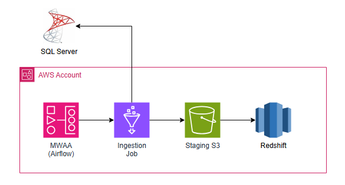
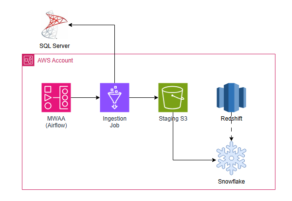
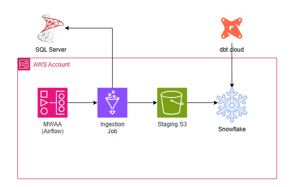

# Data Pipeline Migration: SQL Server to Snowflake

## Overview

This repository contains the migration project for a data pipeline originally designed to move data from SQL Server to a Redshift data warehouse, now evolving to a modern architecture moving data from SQL Server to Snowflake.

The migration aims to improve scalability, performance, governance, and operational efficiency by leveraging Snowflake's cloud-native MPP architecture and integrating with AWS services.

---

## Architecture

### Initial Architecture
<!-- Insert initial architecture image here -->

The initial pipeline ingested data from SQL Server directly into Redshift, orchestrated by legacy tools and scripts. This setup presented challenges in scaling and maintaining data freshness.

### Provisional Architecture
<!-- Insert provisional architecture image here -->

During migration, a provisional architecture was adopted that utilizes AWS Glue and Amazon MWAA (Managed Workflows for Apache Airflow) to orchestrate ETL jobs. Data flows from SQL Server into an S3 staging bucket before loading into Snowflake, enabling better decoupling and easier management.

### Target ("To-Be") Architecture
<!-- Insert To-Be architecture image here -->

The final architecture fully embraces modular, scalable, and governed pipelines, with Spark jobs optimized to read from views rather than the OLTP database directly, minimizing operational impact. Data is staged in S3 as Parquet files before being loaded into Snowflake, allowing for efficient use of Snowflake’s MPP capabilities and providing a clear separation between ingestion and transformation layers.

---

## Summary of Modules

### SQL Server Module
This module defines the OLTP source system, simulating an HR domain with employees, departments, and salary histories. It includes schema definitions, stored procedures, views, and seed data. Views are designed with two approaches:

- **Raw Views:** Provide direct transactional data for flexible ETL ingestion.
- **Analytical Views:** Pre-aggregate metrics for simplified consumption but add load on OLTP.

The recommendation is to use raw views for ingestion to maintain flexibility and offload metric calculations to the data warehouse.

### infra-aws Module
This module provisions AWS infrastructure supporting the pipeline:

- AWS Glue ETL jobs extract data from SQL Server and write Parquet files to S3.
- Amazon MWAA orchestrates the pipeline via Airflow DAGs.
- Terraform manages infrastructure as code, provisioning all necessary resources including S3 buckets, Glue jobs, IAM roles, and MWAA environment.

Trade-offs here include added complexity from multi-step orchestration and increased storage costs due to staging, balanced by improved scalability, modularity, and auditability.

### snowflake-setup Module
Defines Snowflake infrastructure provisioned with Terraform, including warehouses, databases, roles, users, and access grants tailored for ETL workflows.

This module facilitates secure and governed data loading, ensuring minimal privileges with role-based access control, and leverages Snowflake’s native integration with AWS services to optimize data movement and reduce latency.

---

## Trade-offs and Optimizations

- **Decoupling Ingestion and Transformation:** Staging raw data in S3 allows replay, auditability, and separation of concerns but introduces latency and additional storage costs.
  
- **Optimized Spark Jobs:** ETL jobs are designed to read from SQL Server views rather than base tables to avoid contention with OLTP workloads and to isolate operational load.

- **Leveraging Snowflake’s MPP:** Loading data from S3 into Snowflake staging areas maximizes Snowflake’s massively parallel processing capabilities, enabling faster and more efficient data transformations downstream.

- **Governance and Security:** Use of dedicated ETL users, fine-grained IAM roles, and Terraform-managed infrastructure ensures a secure and manageable environment, with least privilege principles enforced.

- **Orchestration and Visibility:** Using Apache Airflow via MWAA centralizes pipeline governance, monitoring, and error handling, providing a single source of truth for workflow execution and status.

- **No Historical Load from Redshift:** The migration does not include loading historical data from Redshift. Instead, it leverages this opportunity to restructure business views using dbt directly on Snowflake data. If historical data is required, it should be ingested through the standard pipeline, avoiding ad-hoc or one-time loads from Redshift. This approach improves data consistency and maintainability while reducing complexity.
---

## Conclusion

This migration represents a strategic modernization of the data platform, shifting from a traditional Redshift pipeline to a Snowflake-centered ecosystem integrated with AWS services. The approach balances scalability, operational efficiency, and governance, enabling future growth and adaptability of data workflows.

## Future Features

- **Implement dbt for Data Modeling and Transformation**  
  Introduce dbt (data build tool) to manage, test, and document SQL transformations in Snowflake, improving maintainability, collaboration, and data quality governance.

- **Evolve SQL Server Connectivity Using AWS Private Managed Services (PMS)**  
  Upgrade the connection architecture to leverage AWS Private Managed Services for enhanced security, reliability, and simplified network management.

- **Automated Data Quality and Monitoring**  
  Integrate data quality checks and anomaly detection within the pipeline, possibly using tools like Great Expectations or Monte Carlo, to ensure pipeline reliability and data trustworthiness.

- **Cost Optimization and Auto-scaling Enhancements**  
  Implement monitoring and auto-scaling policies for AWS Glue and Snowflake warehouses to optimize resource usage and reduce operational costs dynamically.

---

## Visual Assets

- Initial Architecture Diagram
- Provisional Architecture Diagram
- Target Architecture Diagram

*(Add images to the `docs/` folder and update paths accordingly)*

---

If you have questions or suggestions, feel free to open issues or contribute!

