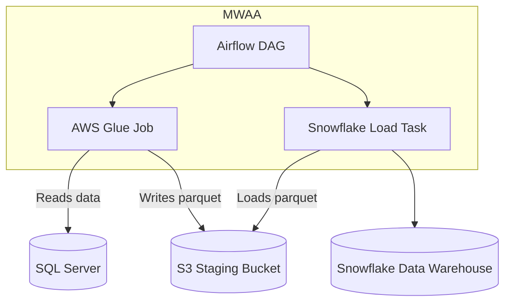

# AWS Infrastructure for Data Pipeline

## Overview

This project provisions AWS infrastructure to support a data pipeline that ingests data from SQL Server into S3 using AWS Glue, orchestrated by Amazon MWAA (Managed Workflows for Apache Airflow), and finally loads data into Snowflake. The pipeline is designed for modularity, security, and scalability.

---

## Architecture Diagram (Mermaid)



## Folder Structure

```yml
├── src/
│ ├── dag.py # Airflow DAG code
│ ├── ingest.py # AWS Glue ETL script (PySpark)
│ ├── requirements.txt # Python dependencies for MWAA environment
├── main.tf # Terraform main configuration and backend setup
├── variables.tf # Terraform variable definitions
├── staging.tf # Terraform for staging S3 bucket resources
├── glue-ingest.tf # Terraform Glue resources (catalog, connection, job)
├── mwaa.tf # Terraform MWAA environment and S3 objects upload
├── iam.tf # IAM roles and policies for Glue and MWAA
└── README.md # This documentation file
```
---

## How It Works

1. **Data Ingestion:**  
   AWS Glue runs a PySpark job that connects to a SQL Server instance, extracts the raw data from a specific table (`HR.Employees`), and writes it as Parquet files into an S3 staging bucket.

2. **Orchestration:**  
   An Airflow DAG deployed in MWAA triggers the Glue job daily, waits for its completion, and then executes a Snowflake load command to copy data from the S3 staging bucket into Snowflake.

3. **Deployment:**  
   Terraform provisions all AWS resources including S3 buckets, Glue components, IAM roles, and the MWAA environment. The DAG and requirements are automatically uploaded to S3 and linked to MWAA.

---

## Running the Pipeline

- Configure your AWS credentials and Snowflake connection.
- Update Terraform variables with your environment specifics (e.g., subnet IDs, security group, JDBC URL).
- Initialize Terraform and apply the infrastructure:

  ```bash
  terraform init
  terraform apply
  ```

- Confirm that the MWAA environment is active.
- The DAG sqlserver_to_snowflake_pipeline will run daily starting from the configured start date.
- Logs and status can be monitored in the Airflow UI via MWAA console.

## Decisions and Trade-offs

### 1. Staging Data on S3 before Snowflake

- **Pros:**  
  - Decouples ingestion from transformation/load steps.  
  - Allows replay and audit by keeping raw data.  
  - Leverages S3 cost-effectiveness and scalability.  
- **Cons:**  
  - Extra storage costs and latency introduced.  
  - Slightly more complex orchestration needed.

### 2. Managing Snowflake Loads inside Airflow DAG

- **Pros:**  
  - Better pipeline governance and visibility.  
  - Single source of truth for orchestration logic.  
- **Cons:**  
  - Adds dependency on Snowflake connectivity from MWAA environment.  
  - Potential for longer DAG runtime if Snowflake is slow.

### 3. Using Glue Only for Data Ingestion (Raw Data Transport)

- **Pros:**  
  - Simplifies Glue job logic and reduces maintenance.  
  - Pushes complex transformations closer to the data warehouse (Snowflake).  
- **Cons:**  
  - Requires Snowflake to handle more complex transformation logic.  
  - Potentially higher compute costs inside Snowflake.

### Additional Considerations

- **Security:** Using IAM roles with least privilege ensures secure data access.  
- **Terraform Backend:** State management in an S3 bucket centralizes infrastructure state.  
- **Versioning:** S3 versioning enabled to track object changes and rollback if needed.

---

## Notes

- Credentials (e.g., SQL Server, Snowflake) are expected to be provided securely, not hardcoded. Use AWS Secrets Manager or environment variables.  
- The Terraform backend bucket (`dp-terraform-state`) should be pre-created before first Terraform apply.

---

Feel free to contribute or raise issues if you find improvements or bugs!

---
