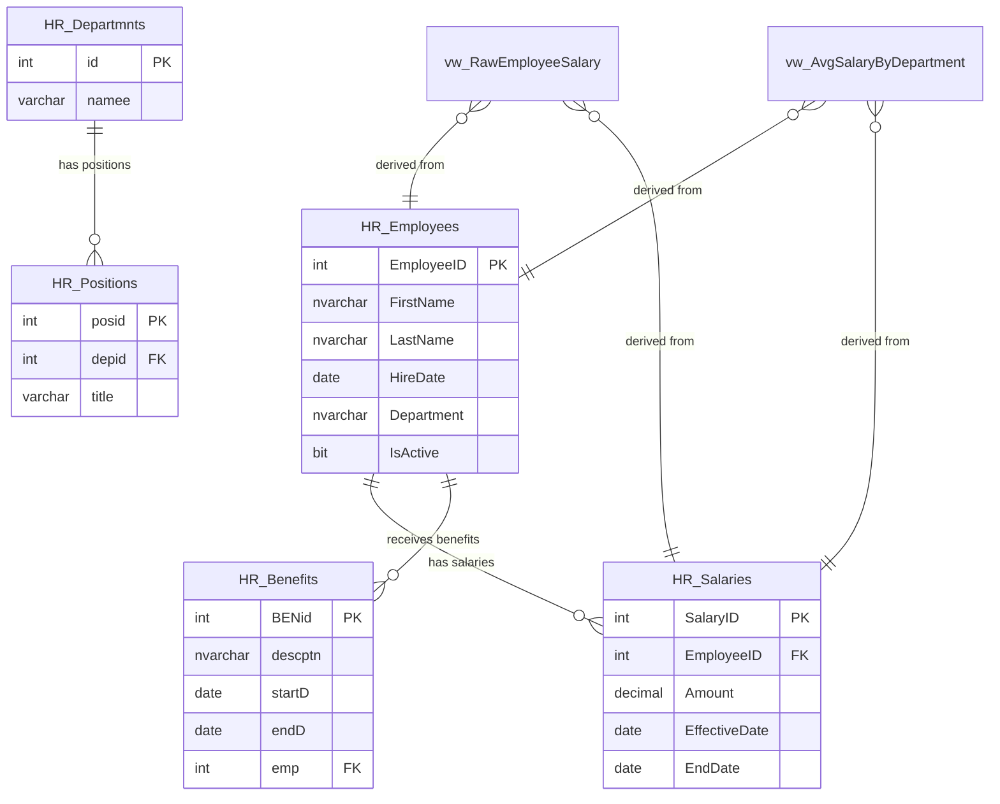

# SQL Server Module – CompanyDB

## Overview
This module defines the OLTP source system used in the portfolio project.  
It simulates a simplified HR domain with employees, salary history, departments, positions, and benefits.



## Structure
```sql
/sql-server/
├── schema/ # DDL scripts (schemas, tables, indexes, constraints)
├── procedures/ # Stored procedures for OLTP operations
├── views/ # Consumption layer (views for ETL/Glue)
├── seed/ # Initial inserts (sample data)
└── README.md
```

## Key Design Choices and Trade-offs

- **Historical salaries**: Stored with `EffectiveDate` and `EndDate`.  
  - Pros: Enables SCD Type 2–style processing.  
  - Cons: Slightly more complex to query and maintain.

- **Indexes**:  
  - `IX_Salaries_Employee_EffectiveDate`: speeds up “latest salary” queries.  
  - `IX_Employees_Department`: supports department-level lookups.  
  - Trade-off: Write operations pay extra cost on insert/update.

- **Stored procedures** (`AddEmployee`, `UpdateSalary`):  
  - Pros: Encapsulates logic, consistency in DML operations.  
  - Cons: More objects to maintain.

- **Isolation level SERIALIZABLE** in procedures:  
  - Pros: Strong consistency.  
  - Cons: Lower concurrency under heavy workloads. In real-world scenarios, `READ COMMITTED SNAPSHOT` is often preferred.

- **Consumption layer via views**:  
  - `vw_EmployeeCurrentSalary` exposes current salary without ETL embedding business logic.  
  - Trade-off: Additional object to maintain, but decouples ETL from transactional schema.

## Views: Raw vs. Analytical

The SQL Server module includes two view styles for simulating ingestion scenarios:

### 1. Raw Views
Example: `vw_RawEmployeeSalary`
- Direct exposure of transactional data, without transformation.
- Useful as a **staging layer** for ETL.
- Maintains flexibility: the Data Warehouse (DWH) concentrates the analytical logic.
- **Trade-offs**: greater volume of data transferred and higher processing costs in the DWH.

### 2. Analytical Views
Example: `vw_AvgSalaryByDepartment`
- Pre-calculates metrics (average, maximum, minimum, count).
- Reduces data traffic and simplifies consumption when metrics are fixed.
- **Trade-offs**: adds load on OLTP, reduces flexibility, and makes metrics governance more difficult (rules are outside the DWH).

### Recommended Decision
- In real-world scenarios, prioritize raw views as the ingestion point and calculate metrics in the DWH (Snowflake, Redshift, etc.).
- Analytical views can be used when "official" metrics already exist in the OLTP, but it's best practice to replicate the logic in the DWH to ensure consistency.

## Additional Setup

- Permissions: consider creating dedicated `etl_user` with SELECT-only access.  
- SQL Server Agent jobs can be scripted to simulate automated inserts/updates.  
- Seed data included for testing ETL pipelines.

---
